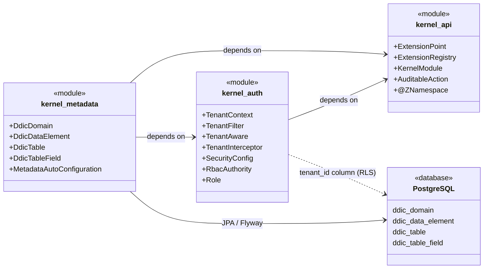

# One ERP Kernel

> A full ERP platform kernel—not a set of CRUD microservices—designed to support healthcare modules, future industry verticals, third-party marketplace extensions, and custom development inside a governed, multi-tenant runtime.

---

## System Overview

The One ERP Kernel is the foundational layer of a platform-first ERP system. It provides the metadata-driven data dictionary (DDIC), tenant-isolated security context, and extension APIs on which all application modules are built.

The kernel is composed of three Gradle subprojects:

| Module | Responsibility |
|---|---|
| **kernel-api** | Defines the extension contracts: `ExtensionPoint`, `ExtensionRegistry`, `KernelModule`, `AuditableAction`, and the `@ZNamespace` annotation. |
| **kernel-auth** | Provides multi-tenant security: `TenantContext` (thread-local tenant ID), `TenantFilter` (HTTP header enforcement), `TenantAware` (JPA `@MappedSuperclass`), `TenantInterceptor` (AOP guard), RBAC authority model, and Spring Security configuration. |
| **kernel-metadata** | Implements the SAP-inspired Data Dictionary: `DdicDomain`, `DdicDataElement`, `DdicTable`, `DdicTableField`, and their Spring Data JPA repositories. |

Applications are built **on top of** this kernel. Every action passes through **Licensing → Authorization → Policy → Audit**; data is not just stored—it is **governed**.

---

## Technical Architecture

The diagram below shows how the three modules relate to each other and to the PostgreSQL database.



---

## The DDIC Concept

Inspired by SAP's Data Dictionary, the kernel-metadata module implements a three-level hierarchy that separates **semantic meaning** from **physical storage**:

```
Domain  ──►  Data Element  ──►  Table Field
```

### Domain (`DdicDomain`)

A Domain defines a **reusable value type**: its underlying data type, length, and decimal places. For example, a domain `AMOUNT` might specify `DECIMAL(15,2)`. Domains are the single source of truth for how a value is technically represented.

### Data Element (`DdicDataElement`)

A Data Element attaches **business semantics** to a domain. It adds a field label and a description that drive UI rendering and documentation. For example, the data element `INVOICE_TOTAL` references the `AMOUNT` domain and carries the label *"Invoice Total"*.

### Table & Table Field (`DdicTable` / `DdicTableField`)

A `DdicTable` represents a governed database table. Each `DdicTableField` within the table references a `DdicDataElement`, inheriting both the technical type from the domain and the business label from the data element. This means:

* Changing a domain's data type propagates consistently to every table that uses it.
* Changing a data element's label updates every UI form that renders the field.

All DDIC entities extend `TenantAware`, ensuring every row is scoped to a specific tenant.

---

## Multi-Tenancy

Tenant isolation is enforced at multiple layers so that a single deployment can safely serve many organizations.

### 1. HTTP Layer — `TenantFilter`

Every inbound request must include an `X-Tenant-ID` header. The `TenantFilter` servlet filter rejects requests without it (HTTP 400) and stores the value in `TenantContext` for the duration of the request.

### 2. Thread Context — `TenantContext`

`TenantContext` uses an `InheritableThreadLocal` to carry the tenant ID through the call stack, including into child threads spawned during the request.

### 3. JPA Persistence — `TenantAware`

All persistent entities extend `TenantAware`, a `@MappedSuperclass` that adds a non-nullable `tenant_id` column. A `@PrePersist` callback automatically populates it from `TenantContext`, guaranteeing that rows are always stamped.

### 4. AOP Guard — `TenantInterceptor`

An `@Around` aspect intercepts every `find*` method in the `com.onehealth.kernel` package and throws an `IllegalStateException` if no tenant context is set, preventing accidental cross-tenant data leaks.

### 5. Database — Row-Level Security (RLS)

At the PostgreSQL level, Row-Level Security policies can further restrict visibility, ensuring isolation even if application-layer checks are bypassed.

---

## Developer Guide — Adding a Z-Extension

The kernel follows a **Clean Core** philosophy: core tables and logic are never modified directly. Custom functionality is added through **Z-namespace extensions**.

### Step 1 — Create the Extension Class

Implement the `ExtensionPoint` marker interface and annotate the class with `@ZNamespace`:

```java
package com.customer.zhospital;

import com.onehealth.kernel.api.ExtensionPoint;
import com.onehealth.kernel.api.ZNamespace;

@ZNamespace("Z_HOSPITAL")
public class ZHospitalDischargeRule implements ExtensionPoint {

    public boolean canDischarge(String patientId) {
        // custom discharge logic
        return true;
    }
}
```

### Step 2 — Register the Extension

Use the `ExtensionRegistry` to register your extension at module startup:

```java
package com.customer.zhospital;

import com.onehealth.kernel.api.KernelModule;
import com.onehealth.kernel.api.ExtensionRegistry;

public class ZHospitalModule implements KernelModule {

    private final ExtensionRegistry registry;

    public ZHospitalModule(ExtensionRegistry registry) {
        this.registry = registry;
    }

    @Override public String getModuleId()   { return "Z_HOSPITAL"; }
    @Override public String getModuleName() { return "Z Hospital Extensions"; }
    @Override public String getVersion()    { return "1.0.0"; }

    @Override
    public void initialize() {
        registry.registerExtension(
            "Z_HOSPITAL",
            "DischargeRule",
            new ZHospitalDischargeRule()
        );
    }
}
```

### Step 3 — Consume the Extension

Retrieve the extension from the registry wherever it is needed:

```java
ZHospitalDischargeRule rule = registry.getExtension(
    "Z_HOSPITAL",
    "DischargeRule",
    ZHospitalDischargeRule.class
);

if (rule.canDischarge(patientId)) {
    // proceed with discharge
}
```

### Conventions

| Convention | Rule |
|---|---|
| **Namespace prefix** | All custom artefacts must begin with `Z_` (e.g., `Z_HOSPITAL`). |
| **No core modification** | Never alter classes or tables outside your `Z_` namespace. |
| **Auditable** | Extensions participate in the same audit trail as core actions via `AuditableAction`. |
| **Tenant-scoped** | Custom entities must extend `TenantAware` to inherit tenant isolation. |

---

## Building the Project

```bash
# Requires Java 17+
./gradlew build
```

## License

See [spec.md](spec.md) for the full system specification.
